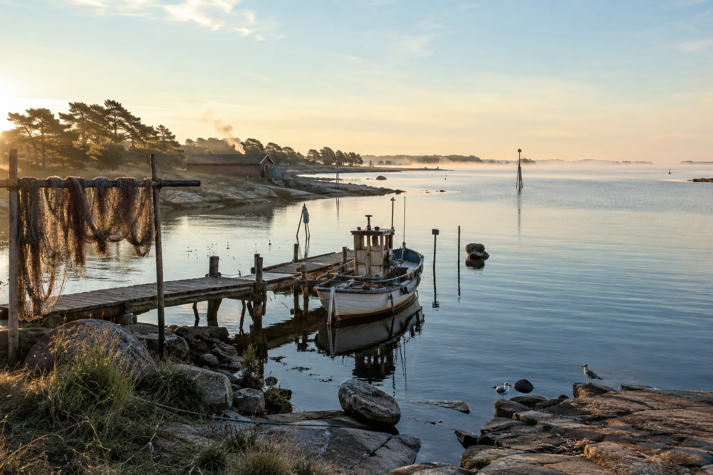
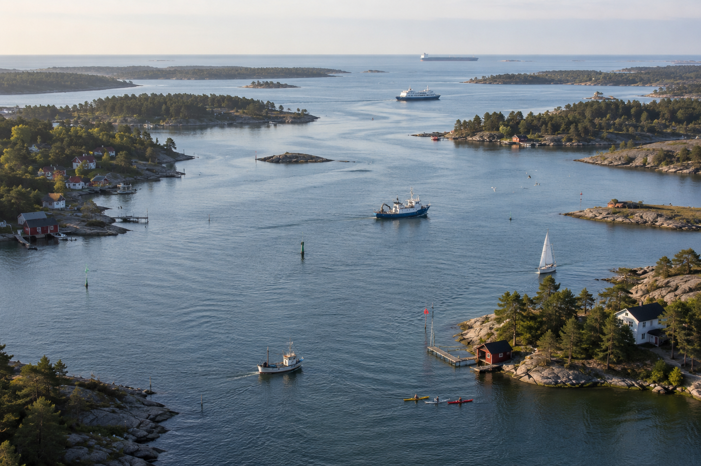
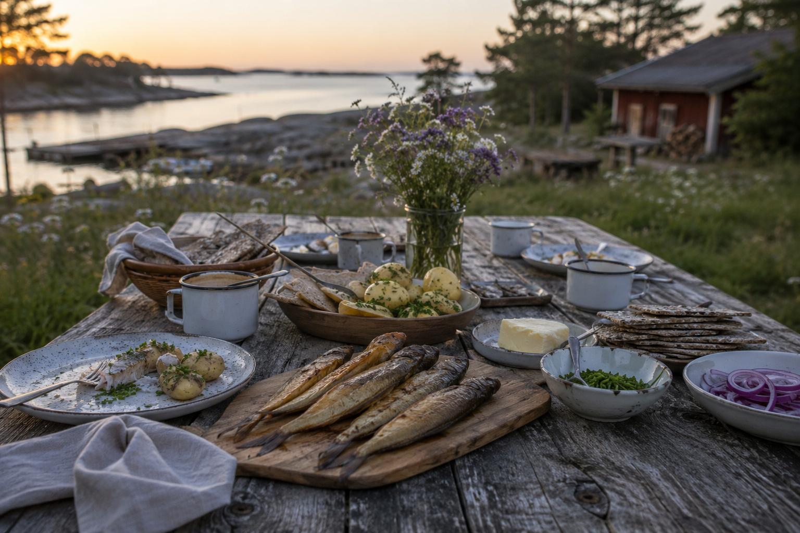
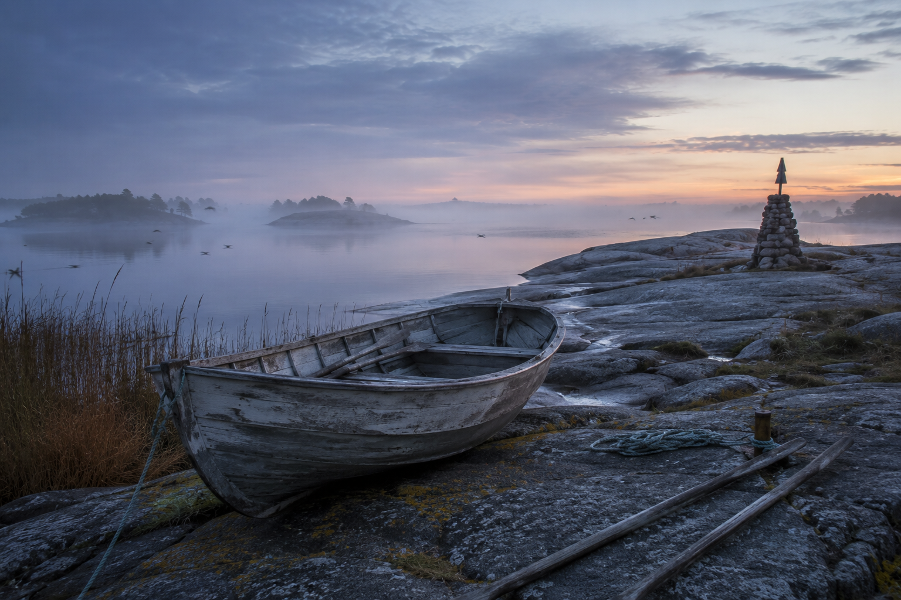
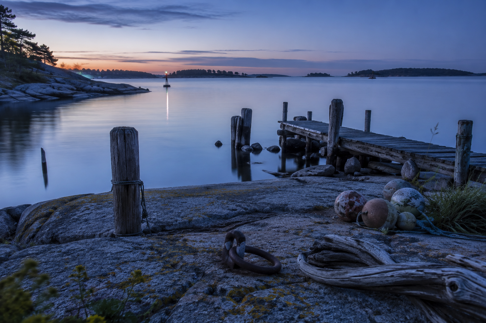
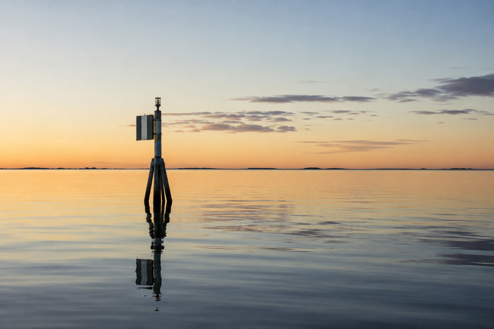

# Before It Became An Issue, It Was Home

Published: 2026-06-25

Lead: A story-first portrait of the Baltic Sea, why it matters in everyday life, and how culture, work, and memory were shaped around it long before modern policy language.

Status: draft
Track: Baltic Sea

---

Before the Baltic became a topic in reports, plans, and headlines, it was simply home.

It was the smell of salt and algae in the wind. Smokehouses. Ferry timetables. Harbor lights in winter. Fish on the table, not as symbolism, but as dinner.

That is where this story begins.

*The Sea That Made Us. A calm opening that frames the Baltic as home before policy language.*

## 1. A Young Sea

Most seas feel ancient in human imagination. The Baltic is different.

In geological terms, it is relatively young, shaped after the last Ice Age when glaciers retreated and left behind a basin that slowly became the sea we recognize today.

Even now, parts of the coastline are still changing. In northern areas, the land continues to rise due to post-glacial rebound. The map is not fixed. It is still being written.

That alone makes the Baltic unusual: it is not only a place with history, it is a place still physically in transition.

## 2. A Strange Sea

The Baltic is not fully ocean and not fully freshwater. It is a large brackish system.

That creates edge conditions. Many species live close to the limits of what they can tolerate. This gives the sea a distinct ecological character that is both resilient and sensitive at the same time.

It also gives the Baltic its own identity. You cannot treat it as interchangeable with the North Sea or Atlantic coastlines. It has its own chemistry, rhythms, and constraints.

## 3. A Highway, Not A Border

For long periods of history, the Baltic functioned less as a dividing line and more as a transport corridor.

People crossed it constantly. Traders, fishers, sailors, soldiers, migrants, pilgrims, craftsmen, and diplomats.

Ports and cities around the basin grew through this movement: Visby, Gdansk, Riga, Tallinn, Stockholm, and many others. The Hanseatic trade networks tied urban life together across language and kingdom boundaries. Viking-era routes connected coasts and river systems. Later empires also organized power and logistics through Baltic access.

The sea carried cargo, but it also carried ideas. Dialects changed. Recipes spread. Technologies moved. Political influence moved with them.

The Baltic has always connected people who otherwise might have remained strangers.

*The Highway. The Baltic as connector, not a border.*

## 4. Food As Cultural Memory

If you want to understand the Baltic in daily life, start with food.

Herring traditions alone tell a lot: pickled, salted, fried, smoked, fermented, festival-served, weekday-served. In Swedish context, boeckling and related smoked fish traditions are not abstract heritage, they are practical memory.

Christmas tables. Midsummer meals. Family methods. Children learning timing, cleaning, and preparation by doing, not by reading.

This is not mainly a nutrition argument. It is a continuity argument.

Some recipes only make sense because this sea exists in this climate with this history.

*The Baltic Table. Culture carried through food, routine, and shared memory.*

## 5. Work, Infrastructure, Everyday Dependence

The Baltic is still a working sea.

Its relevance today is practical and broad:
- fisheries and coastal food chains
- ports, shipping, and freight logistics
- ferries and regional mobility
- energy corridors and marine infrastructure
- tourism and recreation economies
- science, monitoring, and education
- civil preparedness and defense considerations
- nature conservation and protected coastal zones

Millions of people depend on Baltic systems directly or indirectly, often without thinking about the full chain behind ordinary routines.

## 6. Myth, Folklore, And Meaning

Around the Baltic, water has never been only physical.

Nordic sea folklore includes figures linked to the unpredictability and force of the sea. In Lithuanian tradition, the story of Jurate and Kastytis ties the coast to love, loss, and the sea's power. In Scandinavian folklore, Naecken belongs more to rivers and streams than the open sea, but still reflects the region's deeper cultural relationship with dangerous and seductive waters.

Different countries around the Baltic carry different stories, but the pattern is similar: the sea is respected, feared, relied upon, and personified.

Myth does not prove science. It proves long attention.

People project stories onto places that matter to survival.

*Mythology Without Fantasy. Mystery shaped by generations of close attention to water.*

## 7. Why This Story Matters Now

Today, the Baltic is one of the most studied regional seas in the world. Scientists, authorities, NGOs, local communities, and cross-border institutions continuously produce knowledge about it.

That work matters deeply.

But this post is not mainly about diagnosis or policy. It is about orientation.

Before the Baltic was an issue, it was already part of ordinary life.

That is why people still care.

No grand conclusion is needed beyond this:

This place matters.

And if we talk about its future, we should remember its biography, not only its metrics.

*The Sea Remembers. Generations passed; the sea kept their traces.*

*Final Reflection. A quiet marker in open water before any conclusion.*